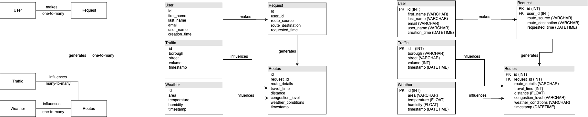
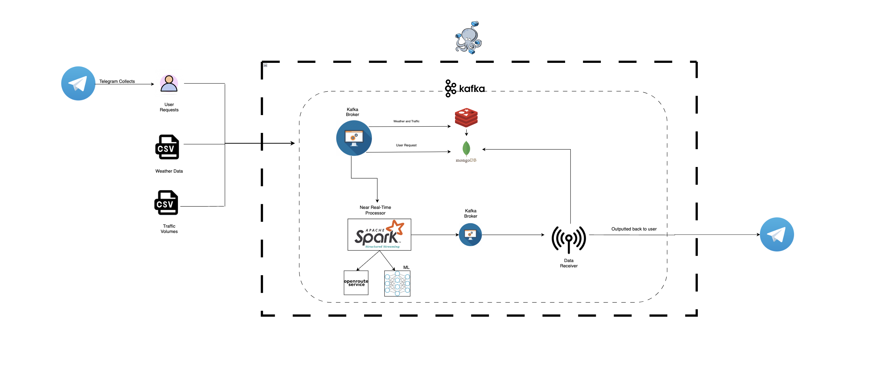
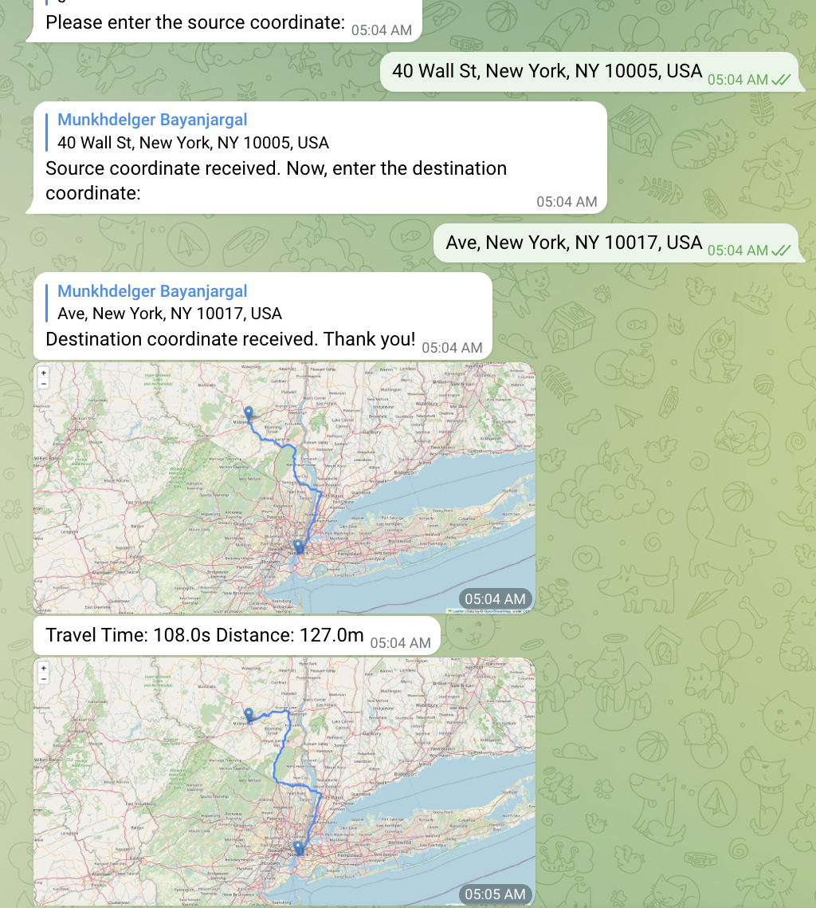

# BDTProject2023: Efficient routing system
_Official Project Repository_

---

_**Abstract**_

RouteService is a user-centric and efficient service designed to assist commuters in selecting optimal routes to avoid traffic congestion in the area of New York City.

---

**Framework functionalities**

- [x] Collection of User Requests, Weather Data, and Traffic Volumes in New York City
- [x] Storing of Weather Data and Traffic Volumes within Redis
- [x] Storing of all data within MongoDB
- [x] Employment of Spark Structured Streaming to create near real-time route optimization system
- [x] Alert calculator through predictions of traffic volumes
- [ ] Data analysis and diagnostics
- [ ] Feedback system

---

**Technologies**

- Apache Kafka
- Redis
- Mongo DB
- Spark Structured Streaming
- Telegram
- Docker Compose
- OpenRouteService

---
**Conceptual Model, Logical Model, and Physical Model**



**Architecture**



---

**Project Files**

> **LSTM 2**
>  - `best_model.pt`
>  - `prediction.py`
>  - `training3.py`

> **docker-files**
> - The folder contains all the Docker Compose YAML files for the technologies

> _Kafka Files_
> 1. `kafka_consumer.py` requires description
> 2. `kafka_producer_route` The file that considers the route requests as producers in the Kafka Process
> 3. `kafka_producer_traffic` File that considers traffic data as producer
> 4. `kafka_producer_weather` File that considers weather data as producer
>    
> _Spark Structured Streaming Files_
> 1. `nrt_stream_process.py` Main data processing file
> 2. `response_distributor.py` Receives results from Spark, then saves them to MongoDB and sends them to the Telegram bot
>
> _Telegram files_
> `telegram_bot.py` Runs a Telegram bot that sends a user request
>
> _Program starter files_
> 1. `start-stack.sh`
> 2. `stop-stack.sh`
>
> _Helper files_
> 1. `user_generator.py` Used for generating users to simulate
> 2. `turnout_function.py` Used for route sender to simulate
> 3. `open_route_manager.py` Open route service class
> 4. `database_manager.py` Mongodb class
> 5. `redis_manager.py` Redis class

> **requirements.txt**: All the packages used in the project


---

**How to run**

```shell copyable

1 pip install -r requirements.txt 
2 ./start-stack.sh

To stop the stack run:
 ./stop-stack.sh
```

---

Simulator
```shell copyable
run - kafka_producer_traffic.py
run - kafka_producer_weather.py
run - kafka_producer_route.py

run - kafka_consumer.py
run - nrt_stream_process.py
run - response_distribute.py

#Test with Telegram
run - telegram_bot.py
run - kafka_consumer.py
run - kafka_producer_traffic.py
run - kafka_producer_weather.py
run - nrt_stream_process.py
run - response_distribute.py
```

On telegram, @routecalculatorBDT_bot is ready to receive requests

---

Framework has been tested with:

- Python 3.10.0
- Docker Desktop 4.20.1
- macOS Ventura 13.4.1


**Telegram Bot**

The name of the bot is @routecalculatorBDT_bot.
It should be used only when running the bot files, as the function bot_polling() must be in use for it to communicate with the user.
More detailed documentation is found within the code. 

example inputs:
- 40 Wall St, New York, NY 10005, USA
- Ave, New York, NY 10017, USA



> **Warning**
> You should have Firefox installed on your running device for the code to produce a proper Folium graph.
> It doesn't consider every single possible exception, try to stick with the given instructions.

---
_Additional things_:

List of Kafka topics:

- `traffic_flow_tpp`
- `weather_tp`
- `route_requests_tp`
- `route_response_tp`

List of MongoDB collections:

- `route_request_tpp`
- `weather_tp`
- `traffic_flow_tp`
- `customers` 
