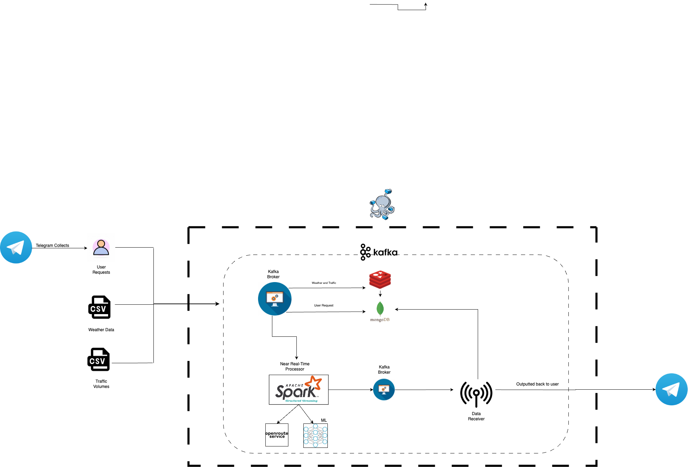

# BDTProject2023: Efficient routing system
_Official Project Repository_

---

_**Abstract**_

RouteService is a user-centric and efficient service designed to assist commuters in selecting optimal routes to avoid traffic congestion in the area of New York City.

---

**Framework functionalities**

- [x] Collection of User Requests, Weather Data, and Traffic Volumes in New York City
- [x] Storing of Weather Data and Traffic Volumes within Redis
- [x] Storing of all data within MongoDB
- [x] Employment of Spark Structured Streaming to create near real-time route optimization system
- [x] Alert calculator through predictions of traffic volumes
- [ ] Data analysis and diagnostics
- [ ] Feedback system

---

**Technologies**

- Apache Kafka
- Redis
- Mongo DB
- Spark Structured Streaming
- Telegram
- Docker Compose
- OpenRouteService

---
**Conceptual Model**
---

---
**Logical Model**
---

---
**Physical Model**
---

**Architecture**



---

**Project Files**

1. `name of file`, describe here
2. `name of file`, more descriptions!

> _Kafka Files_
> 1. `kafka_consumer.py` requires description
> 2. `kafka_producer_route` The file that considers the route requests as producers in the Kafka Process
> 3. `kafka_producer_traffic` File that considers traffic data as producer
> 4. `kafka_producer_weather` File that considers weather data as producer
>    
> _Spark Structured Streaming Files_
> 1. nrt_stream_process.py
> 2. nrt_stream_response.py

> Folders

---

**How to run**

```shell copyable

1 pip install -r requirements.txt 
2 ./start-stack.sh
3 python3 ./simulator.py

#Once the simulator started, type "como" as the city to run the experiment

To stop the stack run:
 ./stop-stack.sh
```

Framework has been tested with:

- Python 3.9
- Docker desktop 4.8.2
- macOS Venture 13.4.1

---

**Simulator**
The simulation aims to reproduce working days of communication between parties.

How does it work?

Generates users and their route requests
Simulation trial starts with tunable params
At the end of each simulation simple statistics are printed out
Simulation works with GUI applications

```python copyable

INTERACTIVE_MODE = True # False to disable console views
NUM_TRIALS = 1 # simulation cycles
SIMULATION_TRIAL_TOTAL_TIME = 60 #seconds, you can set up to 60*60*12
CUSTOMERS_THREADS = 2 # How many pyhton threads should be used to act as clients
TIME_STEP = 0.1 # 0.1 hours = 6 min
TRANSACTIONS_PER_STEP = 10000 # 10000 txns within "TIME_STEP" minutes, can scale to Millions

```
---

_Additional things_:

List of Kafka topics:

- `traffic_flow_tp`
- `weather_tp`
- `route_requests_tp`
- `route_response_tp`

List of MongoDB collections:

- `route_request_tp`
- `weather_tp`
- `traffic_flow_tp`
- `customers` 
